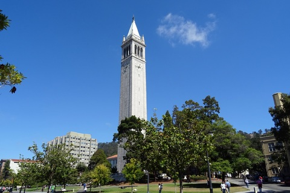

---
# YAML metadata
title: "What is data science?"
author: "Matthew Brett"
linkcolor: blue
urlcolor: blue
bibliography: data-science-bib/data_science.bib
<#ifndef HANDOUT>
suppress-bibliography: true
nocite: |
    @davenport2012data
<#endif>
---

# Two concepts

1. An advanced complex of big data, machine learning and artificial
   intelligence.
2. A basic way of thinking and working with data with a foundation in code.

# History defines

{width=40%}

# Who are these people?

# Initial response

# What went wrong?

{width=30%}

# Other responses

{width=40%}

# What should we do?

{width=40%}

# The end

Materials at <https://github.com/matthew-brett/what-is-data-science>.

Nadal photo by [Manuel Queimadelos](https://www.manuelqueimadelos.com/),
available under [CC-By](https://creativecommons.org/licenses/by/2.0/deed.en) on
[Wikipedia](https://commons.wikimedia.org/wiki/File:Rafael_Nadal_2006.jpg).

UC Berkeley photo from https://pxhere.com CC-0.

See [What is data science?](https://matthew-brett.github.io/cfd2020/intro/what-is-data-science.html) for the argument in more detail, with references.

<#ifdef HANDOUT>
# References
<#endif>
