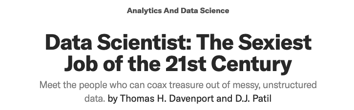

---
# YAML metadata
title: "What is data science?"
author: "Matthew Brett"
linkcolor: blue
urlcolor: blue
bibliography: data-science-bib/data_science.bib
<#ifndef HANDOUT>
suppress-bibliography: true
nocite: |
    @davenport2012data
<#endif>

---

#

{width=100%}

#

> ... what data scientists do is make discoveries while swimming in data ...
> At ease in the digital realm, they are able to bring structure to large
> quantities of formless data and make analysis possible. ... Data scientists’
> most basic, universal skill is the ability to write code.

# The end

Materials at <https://github.com/matthew-brett/what-is-data-science>.

<#ifdef HANDOUT>
# References
<#endif>
